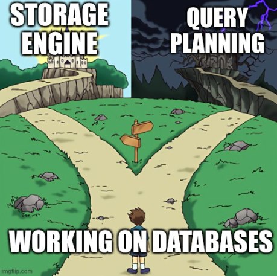

+++
+++
## Raghunandan Bhat

Software Engineer working on databases (stuck at the crossroads).

    
    
credits to <a href="https://x.com/PThorpe92">Preston Thorpe</a>

I like \[Distributed\] Database Systems, Programming Languages, OSS and a bit of Machine Learning. Outside of work: coffee, F1, beekeeping or <a id="rh" href="#">some rabbit hole</a>.

Sometimes I write here, checkout [blog](/blog).

[Email](mailto:raghunandan.bhat96@gmail.com) | [GitHub](https://github.com/raghunandanbhat) | Twitter [(1)](https://x.com/rgndn_bhat), [(2)](https://x.com/smallboxswe) | [LinkedIn](https://www.linkedin.com/in/raghunandan-bhat/)

Thanks to [the original bear blog](https://bearblog.dev/) and [Alan Pearce](https://alanpearce.eu).
