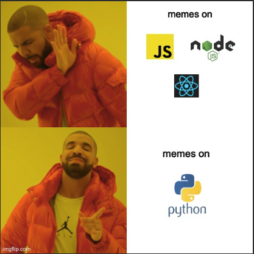
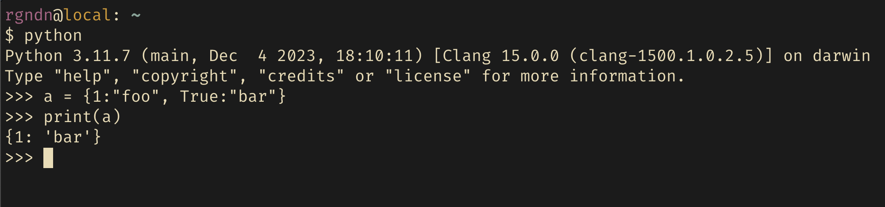

+++
title = "Why do JavaScript devs get to have all the fun?"
date = "2024-03-21"
draft = false
description = ""
taxonomies.tags = [
    "python",
    "javascript",
]
+++

I have seen a lot of memes on JavaScript on the Internet. At this point, JS memes are overtaking the NodeJS memes and time has come to change that. Introducing a new entry into this list - Python. Recently, I have been seeing some quirks of Python on X (twitter) and some of them are my own experiences. This post is all about weird behaviors of Python. Let's go!

<p align="center">
    
</p>

### **Numbers in Python**
You can use an underscore ( `_` ) instead of a comma ( `,` ) in python numbers for better readbility. For example, `1_000_000` is a valid number and it is easy to read. Why is it an issue? Imagine you write a regular expression to match number and you forget to include `_` in it. Good luck debugging it if you're not aware of this fact.

Trust me all of these numbers are valid and this is the correct regular expression to match numbers in python. LGTM if I see this in code review!
```py
numbers = """
Integers: 1_0_0_0, -2_00, +3_0_000
Floats: 1_2.3_4, -0.5_5, +10_0.0_0_1
Scientific: 1e10, 2.5E-3, 1_2.3_4e+5_0_0, -1.2E-1_0
"""

pattern = r'[+-]?\b\d+(_\d+)*(\.\d+(_\d+)*)?([eE][+-]?\d+(_\d+)*)?\b'

matches = re.findall(pattern, numbers)
```

### **Lists in Python**
You can multiply a Python `list` by an integer, and it's totally valid and intuitive. At least, I thought so until I saw this [post](https://x.com/francoisfleuret/status/1770528106513600636) from [François Fleuret](https://twitter.com/francoisfleuret)


The answer to this is simple. Everything in Python is an object, and when the `*` operator is used with a sequence type object, it repeats that object x number of times. `[[]] * 4` produces `[[], [], [], []]`. When `*` is used on an empty `list` object, it simply repeats the same object 4 times. Remember, all 4 empty lists are references to the same empty `list` object. When you append to any one of these empty lists, your modification is reflected in all of its copies.

There's great in-depth explanation for this [here](https://blog.codingconfessions.com/p/why-do-python-lists-multiply-oddly) by [Abhinav](https://twitter.com/abhi9u).


### **Dictionary in Python**
Yet another Python quirk from twitter, posted [here](https://x.com/ryxcommar/status/1772105348872011972).



When python is constrcuting the dictionary, it uses `hash()`, and in case of hash collision, it checks for equivalence. Here, `hash(1) == hash(True) == 1` and `1 == True` in Python. So, the key is overwritten.

### **Few more**
- [Mutable default arguments](https://x.com/voooooogel/status/1770888806641827903)
- [Defining a lambda in a loop that refers to loop varibale](https://x.com/demestive/status/1770930025811910772)
- to be continued...
