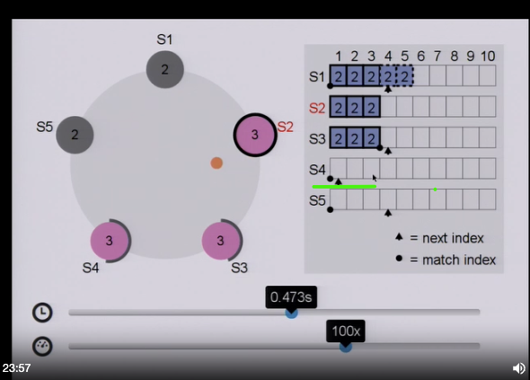
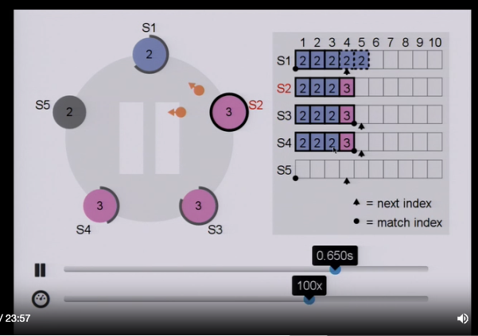

+++
title = "Notes on Raft"
date = "2024-08-10"
draft = false
description = ""
taxonomies.tags = [
    "distributed systems"
]
+++
Raft is a protocol for implementing distributed consensus. Raft builds a replicated state machine using a Replicated log. It considers log as a source of truth and can be used to build inearizable storage.

### Writes:
- clients first write to leader. the leader then sends the write to all the followers.
- followers can respond ‘yes’ or ‘no’ indicating that they have written the value to their log
    - prefix: a point or index in the log, anything previous to the prefix will be same on leader and follower
    - suffix: a point in log, where anything beyond this index in the log may not be in sync wrt to leader and follower
    - whenever writes are proposed, leader sends a prefix and suffix. if the prefix matches with log in follower, follower accepts it and responds ‘yes’
    - if the prefix is not matched, it responds ‘no’. and the leader retries again with (prefix-1)
- if the leader gets majority ‘yes’ from the followers, a quorum is reached. leader commits the message to itself
- sends the commit message to all the followers saying this is the value to commit.
- followers then commit and persist that write.

### Reads:

- if a client reads from a follower and realizes that data is stale, it sends a SYNC signal to leader
- leader propagates this to all followers indicating, to update themselves.
- once the follower is updated, the client reads from the follower

- Leader Election
    - Select one of the servers to act as a leader
- Log replication
    - leader takes commands from the clients, appends it to the log
    - leader replicates its log to the followers or other servers (over writing inconsistencies)
- Safety
    - only a server with up-to-date log can become the leader

### Leader Election:

- Election happens after the timeout. It can happen automatically or it can happen after a leader goes offline.
- A leader continues to be a leader of a term until a follower stops receiving heartbeats
- Terms - or term number
    - its a increasing value that represents a term.
    - all nodes including leader will be in the same term.
    - anything lower than this term number will not accepted by the follower nodes.
    - each time when leader election happens, a node which is trying to become the leader proposes an incremented term number, when asking for votes from other nodes
- the node which wants to become the leader, increases the term number and asks other nodes to vote. This node also votes itself
- when it gets majority of votes, it becomes the leader and sends out a heartbeat to others

### Log replication

#### Normal case Log replication

- leader sends out replication requests to replicas.
- prefix and suffix are also called match index and next index
    - replica and leader agrees everything up to match index
    - new entires will be added to next index
- once a log entry reaches majority of the clusters, it is committed. otherwise the log entry will be in uncommitted state in all of the replicas and the leader

#### Log replication when there are inconsistencies

##### missing entires
- when a replica which was offline for a long time comes up, it will be behind in its log state. So every time leader sends the message to replicate a log, it also asks the replica for a value at index with an term t (term 2 here). do you have a value at index-3 from term-2? if no, the next index moves back, until the leader finds an agreeable value
- then missing values are copied and indexes are moved to make the replica up to date

    

##### extraneous entries

- when a replica (which was a leader before) comes online and it has some uncommitted changes, those will be overwritten
- the new leader sends out a check similar to asking term and logs, the uncommitted entries are overwritten
- this is how s1(pre leader) with uncommitted changes look like. new leader s2 is sending message to s1 asking for the term at the index and over writes it

    

### Safety

- when a candidate (a node which asks for vote become leader) asks for vote to become the leader, it also sends the status of its log.
    - what status is sent? - term of the last log entry and length of the log
- in the above case, S5 is does not have any entry in the log. when it tries become the leader, other nodes which have more up to date logs rejects S5 as leader and does not vote.
- during the next timeout, a new candidate with more up to date log becomes a leader

Types of messages used:

- Request Vote
- Append Entry
